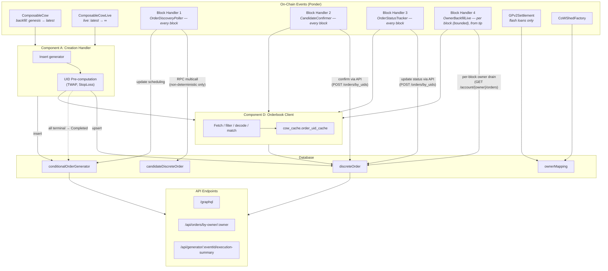
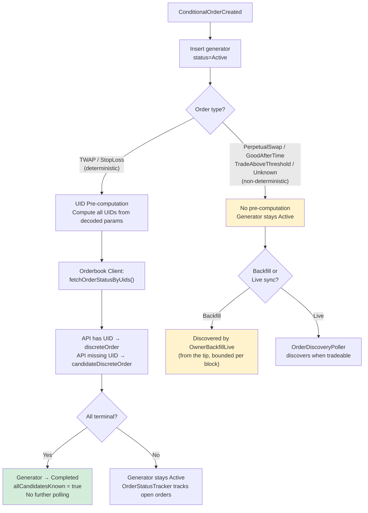
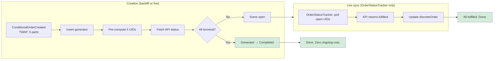
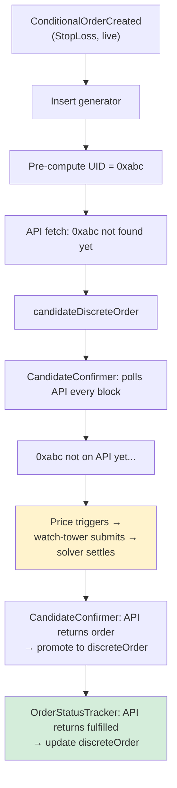
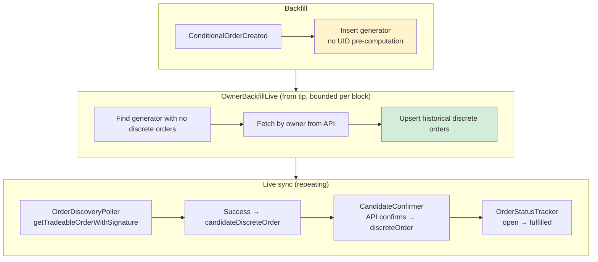
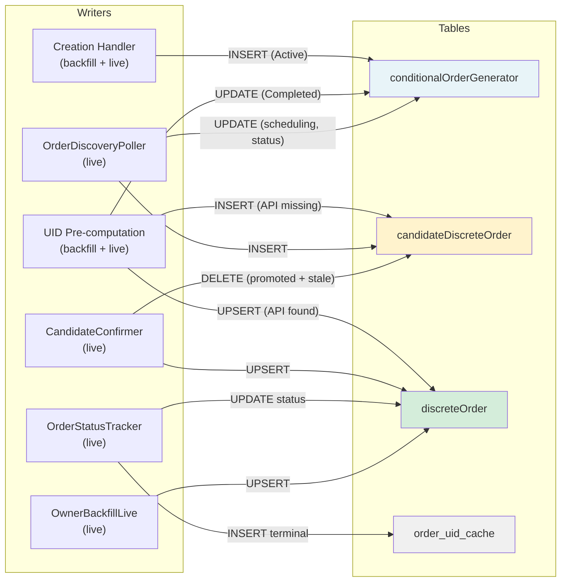

# Orderbook Integration — System Architecture & Flow

This document explains how the discrete order system works, what each component does, and how an order moves through the system from creation to completion.

---

## 1. Components

The system has seven components. Each has a single responsibility.

### Component A: Creation Handler (`composableCow.ts`)

**Responsibility**: Reacts to `ConditionalOrderCreated` events. Creates the generator entity. For deterministic order types, pre-computes all UIDs and fetches their status from the API immediately — at both backfill and live sync.

**Runs during**: Backfill AND live sync (two Ponder contract entries: `ComposableCow` for historical, `ComposableCowLive` for live).

**Key behavior difference by order type**:
- **Deterministic (TWAP, StopLoss)**: Pre-computes UIDs → fetches status from API → UIDs found on API go into `discreteOrder`, UIDs not found go into `candidateDiscreteOrder` → if all are terminal on API, marks generator `Completed` (no further polling needed). This happens at both backfill and live sync.
- **Non-deterministic (PerpetualSwap, GoodAfterTime, TradeAboveThreshold, Unknown)**: Inserts generator only. Discrete orders will be discovered by the block handlers at live sync. Unknown and CowAmmConstantProduct are excluded from the owner backfill (`OWNER_BACKFILL_EXCLUDED` in `utils/order-types.ts`) — their generators are born with `historyBackfilled = true` and only the realtime poller ever touches them.

**Writes to**: `conditionalOrderGenerator`, `discreteOrder` and `candidateDiscreteOrder` (via UID Pre-computation).

### Component B: UID Pre-computation (`uidPrecompute.ts`)

**Responsibility**: For deterministic order types, builds the exact `GPv2Order.Data` struct that the on-chain handler would produce, hashes it via EIP-712 to produce the order UID, then uses the Orderbook Client to fetch the status.

**Why it works**: TWAP and StopLoss contracts produce order data that is fully determined by the `staticInput` params encoded at creation time. The oracle calls in StopLoss only gate whether the order is tradeable — they don't change the order data itself. For TWAP, each part has a deterministic `validTo` based on `t0`, `t`, and the part index.

**Used by**: Creation Handler (both backfill and live). Also available to any future component that needs to know UIDs without RPC calls.

**Writes to**: `discreteOrder` (for UIDs found on API), `candidateDiscreteOrder` (for UIDs not yet on API). Updates `conditionalOrderGenerator.status` to `Completed` if all orders are terminal on API.

### Component OrderDiscoveryPoller (`block/orderDiscoveryPoller.ts`)

**Responsibility**: Polls `getTradeableOrderWithSignature` on the ComposableCoW contract for **non-deterministic** active generators only. Creates candidate discrete orders when the contract returns success. Manages generator scheduling state (nextCheckBlock, nextCheckTimestamp, status).

**When it runs**: Every block at live sync.

**What it polls**: Generators where:
- `status = 'Active'`
- `orderType` is non-deterministic (PerpetualSwap, GoodAfterTime, TradeAboveThreshold, Unknown)
- `allCandidatesKnown = false`
- Due: `nextCheckBlock <= currentBlock` OR `nextCheckTimestamp <= currentTimestamp`

**Why only non-deterministic?** Deterministic orders (TWAP, StopLoss) have their UIDs pre-computed at creation time. There is no need to call the contract — we already know the UIDs and can poll the API directly. This saves RPC calls for the majority of orders.

**Writes to**: `candidateDiscreteOrder`, updates `conditionalOrderGenerator` scheduling fields.

### Component CandidateConfirmer (`block/candidateConfirmer.ts`)

**Responsibility**: Checks if candidate discrete orders exist on the Orderbook API. When confirmed, promotes them to `discreteOrder` and deletes the candidate row.

**When it runs**: Every block at live sync.

**How it works**: Queries `candidateDiscreteOrder` rows that don't yet have a corresponding `discreteOrder` row. Batch-fetches their UIDs from the API via `POST /orders/by_uids`. If the API has the order, upserts into `discreteOrder` with the API's authoritative status, then deletes the `candidateDiscreteOrder` row.

**Cleanup**: After promotion, confirmed candidates are deleted from `candidateDiscreteOrder`. Stale candidates past their `validTo` are also cleaned up — if the watch-tower never submitted them, they're expired and won't appear on the API.

**Why a separate handler?** OrderDiscoveryPoller discovers orders on-chain, but the API may not have them yet (watch-tower submission delay). This handler polls the API repeatedly until the candidate is confirmed. Separation means OrderDiscoveryPoller focuses on RPC, CandidateConfirmer focuses on API — different cost profiles, can be tuned independently.

**Writes to**: `discreteOrder`. **Deletes from**: `candidateDiscreteOrder`.

### Component OrderStatusTracker (`block/orderStatusTracker.ts`)

**Responsibility**: Polls the API for status updates on non-terminal discrete orders. Detects when open orders become fulfilled, expired, or cancelled.

**When it runs**: Every block at live sync.

**How it works**: Queries `discreteOrder` rows where `status = 'open'`. Batch-fetches their UIDs from the API. Updates status to the API's authoritative value. Also expires orders where `validTo <= currentTimestamp`.

**Why a separate handler?** This is pure API work — no RPC calls. It runs for ALL open discrete orders regardless of how they were discovered (pre-computation, contract poller, or owner fetch).

**Writes to**: `discreteOrder`, `cow_cache.order_uid_cache` (caches newly terminal).

### Component OwnerBackfillLive (`block/ownerBackfill.ts`)

**Responsibility**: Discovery of historical discrete orders for non-deterministic generators (the realtime poller only ever returns the *current* tradeable order, never past fulfilled/expired ones). Bounded batch per firing so the work spreads across blocks instead of one burst.

**Registration**: `startBlock: "latest"`, fine interval. Runs during live sync, draining owner history from the tip onward. `/readyz` gates promotion on the drain completing, so it returns pending until every eligible owner is drained.

**How it works**: Each firing selects up to `MAX_OWNERS_BACKFILL_PER_BLOCK_<chainId>` (default 20) distinct owners with `status = 'Active'`, a backfill-eligible `orderType` (`OWNER_BACKFILL_TYPES` — the non-deterministic set minus Unknown and CowAmmConstantProduct), and `historyBackfilled = false`, picked least-recently-attempted first (never-attempted first) so a slow owner rotates to the back of the queue instead of blocking every batch. For each, it stamps the attempt in `cow_cache.owner_drain`, runs `drainOwnerSlice(owner)` under an AbortController deadline (`BOOTSTRAP_OWNER_FETCH_TIMEOUT_MS`), and sets `historyBackfilled = true` on that owner's generators **only when the drain reports complete**. An incomplete slice (rate limit / deadline) is not wasted: every fetched page is already persisted along with the resume offset, and the next attempt continues from there. No retry queue — the flag *is* the queue.

Eligibility is gated on the dedicated `conditionalOrderGenerator.historyBackfilled` flag, **not** on "has zero discrete orders". An active generator the realtime `OrderDiscoveryPoller` has already inserted a row for is still backfilled. The flag is set at generator creation (composableCow.ts) for the cases that never need a drain — deterministic types (precompute handles them), generators created during live sync (owned by the poller from birth), and the excluded types Unknown/CowAmmConstantProduct — so the only `false` rows are backfill-eligible historical generators.

**Why bounded + repeating**: at production scale there are thousands of non-deterministic generators; draining them all in one firing would exceed the orderbook rate limit and hold one giant transaction. Spreading a bounded batch per block is wall-clock-paced (rate-limit friendly) and keeps transactions small. Promotion readiness is gated on the drain completing (`/readyz`) so infrastructure can avoid routing traffic to a pod with history still filling.

**Cost across deploys**: Ponder rebuilds onchain tables from scratch on every schema-hash redeploy (`historyBackfilled` and `discreteOrder` included), so this handler re-runs each deploy. Both cache tables survive reindex: `cow_cache.composable_order` holds the full composable-order rows and `cow_cache.owner_drain` records whether the owner was ever fully drained (`fully_drained`) plus the `delta_cursor` a complete pass covered. A redeployed owner with `fully_drained = true` takes the cheap delta path — fetch only orders newer than the cursor, rebuild the rest from the cache — see the Orderbook Client below.

**Writes to**: `discreteOrder`, `conditionalOrderGenerator` (`historyBackfilled`), `cow_cache.composable_order`, `cow_cache.owner_drain`.

### Component FlashLoanOrderBackfiller + FlashLoanOrderEnricher (`block/flashLoanOrderBackfiller.ts`, `block/flashLoanOrderEnricher.ts`)

**Responsibility**: Enrich `flashLoanOrder` rows (recorded by the settlement handler with on-chain data only) with the CoW-order fields the orderbook holds — `kind`, `receiver`, `sellAmountIntended`, `buyAmountIntended`, and authoritative executed amounts. The adapter's `getHookData()` struct is wiped at settlement, so the orderbook is the source of truth.

**Split (mirrors OwnerBackfillLive + OrderStatusTracker)**:
- `FlashLoanOrderBackfiller` — one-shot at go-live (`startBlock = endBlock = "latest"`). Bulk-drains the entire historical backlog (`enrichedAt IS NULL`) in bounded sequential slices (`FLASH_LOAN_BACKFILL_SLICE_SIZE`) so the whole drain happens in one firing.
- `FlashLoanOrderEnricher` — every block. Enriches orders that settle during live sync, plus any stragglers, capped at `MAX_FLASH_LOAN_ORDERS_PER_BLOCK_<chainId>`.

**How it works**: both call one shared routine — fetch the batch via `fetchFlashLoanEnrichmentByUids` (cache-first), upsert orderbook fields + `enrichedAt` on hits, bump `enrichmentAttempts` on misses (up to `MAX_FLASH_LOAN_ENRICHMENT_ATTEMPTS`, then abandoned). Enrichment never runs in the historical path.

**Writes to**: `flashLoanOrder`, `cow_cache.order_uid_cache`.

### Component D: Orderbook Client (`orderbookClient.ts`)

**Responsibility**: The single interface to the CoW Protocol Orderbook API. All API calls go through this module. It handles fetching, filtering, EIP-1271 signature decoding, generator matching, and per-UID caching.

**Public functions**:
- `drainOwnerSlice(context, chainId, owner, signal?)` — one bounded, resumable drain attempt for an owner (see below)
- `fetchAccountOrders(apiBaseUrl, owner, maxPages?, signingScheme?, pageSize?, sinceCreationDate?, opts?)` — paginated `/account/{owner}/orders` fetch; with `sinceCreationDate` it stops once a (newest-first) page dips below the cursor; `opts` carries `startOffset` (resume), `onPage` (per-page persistence callback), and `signal` (abort between pages and tear down the in-flight request)
- `fetchOrderStatusByUids(context, chainId, uids)` — batch UID status lookup with cache
- `fetchFlashLoanEnrichmentByUids(context, chainId, uids)` — batch UID enrichment for flash-loan orders, cache-first
- `upsertDiscreteOrders(context, chainId, orders)` — chunked write to discreteOrder table

**`drainOwnerSlice` — resumable drain**: progress lives in `cow_cache.owner_drain`, never derived from cached rows (deriving a cursor from `MAX(creation_date)` conflates "I cached this" with "I cached everything older" — a partial drain would look complete and leave a permanent hole). Two modes, keyed on `fully_drained`:

- **Full drain** (`fully_drained = false`): resume `/account/{owner}/orders` pagination at `next_offset`. Each page is persisted immediately (durable cache + `discreteOrder`) before `next_offset` advances, so an aborted or rate-limited slice loses nothing. On reaching the last page, one completion pass rebuilds the full set from the durable cache (it can hold rows the API no longer returns — aged-out orders cached by a prior deployment), re-checks still-open rows via `/orders/by_uids`, re-maps `generator_hash → current eventId`, and sets `fully_drained`.
- **Delta** (`fully_drained = true`, e.g. after a redeploy): fetch only orders newer than `delta_cursor`, then rebuild from the cache as above. The cursor advances **only when the pass reports complete** — an incomplete delta re-fetches the same window later (overlap, never a gap).

**Writes to**: `discreteOrder`, `cow_cache.composable_order`, `cow_cache.owner_drain`, `cow_cache.order_uid_cache`.

### Component E: API Endpoints (`api/index.ts`)

**Responsibility**: Exposes data to consumers. Read-only.

- `/graphql` — auto-generated by Ponder, all tables with filtering and relations
- `/api/orders/by-owner/:owner` — discrete orders resolved through ownerMapping (CoWShed proxies)
- `/api/generator/:eventId/execution-summary` — count breakdown by status

---

## 2. Data Model

### `conditionalOrderGenerator`

The parent entity. One row per `ConditionalOrderCreated` event.

| Column | Purpose |
|--------|---------|
| `eventId` | Ponder event ID (PK with chainId) |
| `owner` | Contract address (may be a CoWShed proxy) |
| `resolvedOwner` | The EOA behind the proxy |
| `handler`, `salt`, `staticInput`, `hash` | On-chain order parameters |
| `orderType` | TWAP, StopLoss, PerpetualSwap, GoodAfterTime, TradeAboveThreshold, Unknown |
| `status` | **Active** (needs polling), **Cancelled** (on-chain removal), **Completed** (all orders terminal or PollNever) |
| `decodedParams` | JSON with decoded staticInput |
| `decodeError` | `"invalid_static_input"` or null |
| `txHash` | FK → transaction.hash |
| `nextCheckBlock` | When the contract poller should next check this generator |
| `nextCheckTimestamp` | For PollTryAtEpoch — stored directly, no estimation |
| `lastCheckBlock`, `lastPollResult` | Audit trail |
| `allCandidatesKnown` | Boolean — when true, contract poller skips this generator (all UIDs discovered) |

### `discreteOrder`

Confirmed orders. API-authoritative status. What consumers query.

| Column | Purpose |
|--------|---------|
| `orderUid` | CoW Protocol order UID (PK with chainId) |
| `conditionalOrderGeneratorId` | FK to parent generator |
| `status` | **open**, **fulfilled**, **expired**, **cancelled**, **unfilled** |
| `partIndex` | TWAP part number (0-indexed). Null for non-TWAP. |
| `sellAmount`, `buyAmount`, `feeAmount` | Order amounts |
| `validTo` | Unix timestamp when this order expires |
| `creationDate` | When the order was created |

### `candidateDiscreteOrder`

Orders discovered on-chain (by OrderDiscoveryPoller or UID pre-computation) but not yet confirmed on the Orderbook API. Same schema as `discreteOrder` minus the `status` column — candidates are pending by definition. CandidateConfirmer promotes them to `discreteOrder` once the API has them.

### `cow_cache.order_uid_cache`

Shared per-UID terminal-order cache. Survives Ponder resyncs (external `cow_cache` schema), so a reindex doesn't re-hit the orderbook. Used by both the discrete-order path (status + executed amounts) and the flash-loan path (kind/receiver/intended + executed amounts). The flash-loan columns are nullable; the two UID populations are disjoint, so they never collide.

| Column | Purpose |
|--------|---------|
| `chain_id`, `order_uid` | Primary key |
| `status` | Terminal only: fulfilled, expired, cancelled (flash-loan rows: always `fulfilled`) |
| `executed_sell_amount`, `executed_buy_amount` | Executed amounts |
| `kind`, `receiver`, `sell_amount`, `buy_amount` | Flash-loan enrichment fields (null for discrete rows) |
| `fetched_at` | When it was cached |

### `cow_cache.composable_order`

Durable **full** composable-order rows for the OwnerBackfillLive drain. Like `order_uid_cache` it lives in the external `cow_cache` schema and survives reindex — but it stores every field needed to rebuild a `discreteOrder` row (not just terminal status), so a redeployed owner rebuilds from the cache instead of re-fetching its whole history. It stores the stable `generator_hash` rather than the per-deployment `eventId`, which `drainOwnerSlice` re-maps to the current generator on read. Created in `setup.ts`. Drain progress is **not** derived from this table — that's `owner_drain`'s job.

| Column | Purpose |
|--------|---------|
| `chain_id`, `order_uid` | Primary key |
| `owner` | Indexed (`chain_id`, `owner`) — per-owner rebuild |
| `generator_hash` | Stable `keccak256(handler, salt, staticInput)`; re-mapped to the current generator `eventId` on read |
| `order_type` | Handler-derived order type |
| `status`, `sell_amount`, `buy_amount`, `fee_amount`, `valid_to`, `executed_sell_amount`, `executed_buy_amount` | Full order fields to rebuild `discreteOrder` |
| `creation_date` | Orderbook creation timestamp (seconds) |
| `fetched_at` | When it was cached |

### `cow_cache.owner_drain`

Per-owner drain state for OwnerBackfillLive. One row per `(chain_id, owner)`, created in `setup.ts`, survives reindex. Progress is recorded here explicitly — never derived from cached rows, which is what made the old `MAX(creation_date)` cursor silently skip history after a partial drain.

| Column | Purpose |
|--------|---------|
| `chain_id`, `owner` | Primary key |
| `next_offset` | Where the initial full drain resumes `/account` pagination; advanced only after the page's rows are persisted |
| `fully_drained` | A full pass reached the last page at least once; gates the delta path |
| `delta_cursor` | Newest `creation_date` covered by a complete pass; only read when `fully_drained`, only advanced by a complete delta pass |
| `last_attempt_at` | Stamped at attempt start; drives least-recently-attempted batch rotation |

---

## 3. Detailed Flows

### 3.1 Order Creation — Deterministic Types (TWAP, StopLoss)

**Applies to both backfill and live sync.** The flow is the same because we can compute UIDs without RPC calls.

1. **Event arrives.** `ConditionalOrderCreated` from either `ComposableCow` (historical) or `ComposableCowLive` (live).

2. **Generator insert.** Parse event, resolve owner, decode staticInput, insert `conditionalOrderGenerator` with `status = 'Active'`.

3. **UID pre-computation.** Call `precomputeAndDiscover()`:
   - **TWAP**: Build `GPv2Order.Data` for each of N parts. `validTo = t0 + (i+1)*t - 1` (span=0) or `t0 + i*t + span - 1` (span>0). When `t0=0`, use `event.block.timestamp`. Hash each via EIP-712 → N UIDs.
   - **StopLoss**: Build single `GPv2Order.Data` from decoded params. All fields from staticInput. Hash via EIP-712 → 1 UID.

4. **API status lookup.** Call `fetchOrderStatusByUids()`:
   - Check `order_uid_cache` for each UID
   - Cached terminal → use cached (no API call)
   - Not cached → batch-fetch via `POST /orders/by_uids`
   - Cache newly terminal results

5. **Insert results.** For each UID:
   - **Found on API** → upsert into `discreteOrder` with API-authoritative status.
   - **Not found on API** → insert into `candidateDiscreteOrder`. CandidateConfirmer will promote to `discreteOrder` when the API has it.

6. **Generator deactivation.** If ALL orders are terminal on the API → set `status = 'Completed'`, `allCandidatesKnown = true`, `lastPollResult = 'precompute:allTerminal'`. No further polling needed. If some UIDs are candidates (not yet on API), the generator stays Active — `allCandidatesKnown` is still set to `true` so OrderDiscoveryPoller skips it.

**Result**: Deterministic orders are fully discovered at creation time. They never need OrderDiscoveryPoller. OrderStatusTracker handles any open orders that haven't settled yet.

### 3.2 Order Creation — Non-Deterministic Types

**Applies to both backfill and live sync.**

1. **Generator insert.** Same as above.

2. **UID pre-computation returns null.** Can't compute UIDs for PerpetualSwap, GoodAfterTime, TradeAboveThreshold, or Unknown types.

3. **Generator stays Active.** OrderDiscoveryPoller will pick it up at live sync.

**During backfill**: No discrete orders created. OwnerBackfillLive fills this gap once sync reaches the tip — except for Unknown and CowAmmConstantProduct generators, which are excluded from the backfill and created with `historyBackfilled = true`.

**During live sync**: OrderDiscoveryPoller discovers orders when `getTradeableOrderWithSignature` returns success.

### 3.3 OrderDiscoveryPoller — Non-Deterministic Orders

**When**: Every block at live sync.

1. **Find due generators.** Query where `status = 'Active'` AND `allCandidatesKnown = false` AND non-deterministic orderType AND (`nextCheckBlock <= currentBlock` OR `nextCheckTimestamp <= currentTimestamp`).

2. **Batch multicall.** Call `getTradeableOrderWithSignature(owner, params, "0x", [])` on ComposableCoW.

3. **Process results:**

| Result | Action |
|--------|--------|
| **Success** | Compute `orderUid`, INSERT `candidateDiscreteOrder`, schedule recheck |
| **PollTryNextBlock / OrderNotValid / Unknown** | `nextCheckBlock = currentBlock + 1` |
| **PollTryAtBlock(N)** | `nextCheckBlock = N` |
| **PollTryAtEpoch(T)** | `nextCheckTimestamp = T` |
| **PollNever(reason)** | `status = 'Completed'`. Do NOT expire discrete orders. |

4. **Note on `allCandidatesKnown`**: For confirmed single-shot non-deterministic types (**GoodAfterTime**, **TradeAboveThreshold**), once the contract returns success once, set `allCandidatesKnown = true` — the order UID is now known and CandidateConfirmer/OrderStatusTracker handle the rest. For repeating orders (**PerpetualSwap**) and **Unknown** types (which may be multi-part), this flag stays `false`.

### 3.4 CandidateConfirmer — Promoting Candidates

**When**: Every block at live sync.

1. **Find unconfirmed candidates.** Query `candidateDiscreteOrder` rows whose `orderUid` does NOT exist in `discreteOrder`.

2. **Batch-fetch from API.** Call `POST /orders/by_uids` for the unconfirmed UIDs.

3. **For each found on API:** Upsert into `discreteOrder` with the API's authoritative status.

4. **For each NOT found:** Leave as candidate. Will be checked again next block. The watch-tower may not have submitted it yet.

5. **Cleanup:** Delete promoted candidates from `candidateDiscreteOrder`. Also delete stale candidates past their `validTo` — the watch-tower likely never submitted them.

### 3.5 OrderStatusTracker — Tracking Open Orders

**When**: Every block at live sync.

1. **Find open discrete orders.** Query `discreteOrder` where `status = 'open'`.

2. **Batch-fetch from API.** Call `POST /orders/by_uids`.

3. **Update statuses.** If the API says `fulfilled` → update. If `expired` or `cancelled` → update. Cache terminal UIDs in `order_uid_cache`.

4. **Expire by validTo.** Any `discreteOrder` where `status = 'open'` and `validTo <= currentTimestamp` → set to `expired`.

### 3.6 OwnerBackfillLive — Historical Discovery (per-block, bounded)

**When**: From the tip onward (live sync, `startBlock: "latest"`, fine interval). This is the owner-history drain.

1. **Select a bounded batch.** Up to `MAX_OWNERS_BACKFILL_PER_BLOCK_<chainId>` (default 20) distinct owners with `status = 'Active'` AND `orderType` in `OWNER_BACKFILL_TYPES` (non-deterministic minus Unknown/CowAmmConstantProduct) AND `historyBackfilled = false`, LEFT JOINed with `cow_cache.owner_drain` and ordered `last_attempt_at ASC NULLS FIRST` — least-recently-attempted first, never-attempted first. (Gated on the flag, **not** on "no discreteOrder rows" — so generators the realtime poller already touched are still backfilled.)

2. **Drain a slice per owner.** For each, stamp `last_attempt_at`, then run `drainOwnerSlice(owner)` under a `BOOTSTRAP_OWNER_FETCH_TIMEOUT_MS` AbortController deadline. Set `historyBackfilled = true` on that owner's generators **only when the slice reports complete**; otherwise the owner stays eligible with its progress banked in `owner_drain`.

3. **Repeat.** The next firing takes the next batch (drained owners have dropped out; partially drained owners resume from their stored offset). When no eligible owner remains, the query is a cheap no-op. Readiness (`/readyz`) turns green once the pending count hits 0.

### 3.7 Orderbook Client — Fetch & Cache Logic

The Orderbook Client is used by all other components. Two main entry points:

**`drainOwnerSlice(context, chainId, owner, signal?)`** — one resumable drain attempt:

1. Resolve API URL from `ORDERBOOK_API_URLS[chainId]`; read the owner's `cow_cache.owner_drain` row (missing ⇒ fresh: offset 0, not drained)
2. **Full-drain mode** (`fully_drained = false`): `GET /account/{owner}/orders` (paginated, 1000/page, newest-first) starting at `next_offset`. Per page: filter (`signingScheme = "eip1271"`, skip `presignaturePending`), decode EIP-1271 signatures, match to generators by hash (one batched lookup), persist into `cow_cache.composable_order` + `discreteOrder` (chunked upserts), then advance `next_offset`. The offset-0 page also records the `delta_cursor` candidate (its first order is the newest at drain start). The abort signal ends the slice between pages and tears down the in-flight request.
3. **Completion pass** (last page reached): rebuild the full owner set from `cow_cache.composable_order` (includes aged-out rows from prior deployments), re-check still-open rows via `POST /orders/by_uids`, re-map `generator_hash → current generator eventId`, upsert, set `fully_drained`
4. **Delta mode** (`fully_drained = true`): fetch only orders newer than `delta_cursor` (pagination stops once a page dips below it), then run the same rebuild as the completion pass. Advance `delta_cursor` **only when the pass reports complete**

**`fetchOrderStatusByUids(context, chainId, uids)`** — Batch UID lookup:

1. Check `order_uid_cache` for each UID
2. Batch-fetch non-cached via `POST /orders/by_uids`
3. Cache terminal results
4. Return `Map<uid, status>`

---

## 4. Order Type Lifecycles

### TWAP — Deterministic, multi-part

**Backfill:** Generator created → all N part UIDs pre-computed → API status fetched → UIDs found on API go into `discreteOrder`, UIDs not found go into `candidateDiscreteOrder` → if all terminal on API, generator marked Completed.

**Live sync:** Same as backfill (UID pre-computation works at both). UIDs not yet on API are candidates; CandidateConfirmer promotes when API confirms. OrderStatusTracker tracks open `discreteOrder` rows.

**OrderDiscoveryPoller is NEVER involved for TWAP.** All discovery happens via UID pre-computation.

### StopLoss — Deterministic, single-part

**Backfill:** Generator created → single UID pre-computed → API status fetched → if found on API, `discreteOrder` created; if not, `candidateDiscreteOrder` → if terminal on API, generator marked Completed.

**Live sync:** Same as backfill. If the order is still open (price hasn't triggered yet), OrderStatusTracker tracks it. OrderDiscoveryPoller is not involved.

**Key insight:** We don't need to call `getTradeableOrderWithSignature` for StopLoss. We know the UID from creation. The API will show `fulfilled` once the watch-tower submits and the solver settles.

### PerpetualSwap — Non-deterministic, repeating

**Backfill:** Generator created, no discrete orders. OwnerBackfillLive discovers them once sync reaches the tip.

**Live sync:** OrderDiscoveryPoller polls every block → success during active windows → candidate created → CandidateConfirmer confirms on API → OrderStatusTracker tracks until fulfilled.

### GoodAfterTime / TradeAboveThreshold — Non-deterministic, single-part

**Backfill:** Generator created, no discrete orders. OwnerBackfillLive discovers them once sync reaches the tip.

**Live sync:** OrderDiscoveryPoller polls → success when condition met → candidate → CandidateConfirmer confirms → after first success, `allCandidatesKnown = true` → OrderDiscoveryPoller stops polling this generator.

---

## 5. End-to-End Scenarios

### Scenario A: TWAP with 5 parts, created 2 months ago (backfill)

1. Block 18M: `ConditionalOrderCreated`. Generator inserted. UID Pre-computation computes 5 UIDs.
2. API batch fetch: all 5 → `fulfilled`. Cached in `order_uid_cache`.
3. 5 `discreteOrder` rows created (all fulfilled).
4. Generator → `Completed` (`allCandidatesKnown = true`).
5. **At live sync**: OrderDiscoveryPoller skips this generator. OrderStatusTracker has nothing to update. Zero ongoing cost.

### Scenario B: StopLoss, created at live sync, price triggers 3 hours later

1. Live block: `ConditionalOrderCreated`. Generator inserted. UID Pre-computed = `0xabc...`.
2. API fetch: `0xabc` not found (watch-tower hasn't submitted yet). `candidateDiscreteOrder` inserted.
3. **CandidateConfirmer polls every block**: `0xabc` → API still not found. Retry next block.
4. 3 hours later: price triggers, watch-tower submits, solver settles.
5. **CandidateConfirmer polls**: `0xabc` → API returns order. Promoted to `discreteOrder`. Candidate deleted.
6. **OrderStatusTracker polls**: `0xabc` → `fulfilled`. `discreteOrder` updated. Cached as terminal.
7. Generator stays Active until block handler checks and gets `PollNever` → `Completed`.

**Note:** OrderDiscoveryPoller is NOT involved. The UID was known from creation. Status tracking is pure API work.

### Scenario C: PerpetualSwap, created 3 months ago (non-deterministic)

1. Backfill: Generator created, `status = 'Active'`. UID Pre-computation returns null.
2. **OwnerBackfillLive, from the tip onward**: Finds this generator eligible (`historyBackfilled = false`). Fetches by owner from API. Discovers 15 historical orders. Upserts all into `discreteOrder`.
3. **OrderDiscoveryPoller at live sync**: Polls `getTradeableOrderWithSignature`. Gets `Success` during active window → candidate created.
4. **CandidateConfirmer**: Checks API → confirms → `discreteOrder`.
5. **OrderStatusTracker**: Tracks open orders → `fulfilled` when settled.
6. PerpetualSwap keeps producing new orders → OrderDiscoveryPoller keeps discovering them.

### Scenario D: Unknown order type, created during backfill

1. Backfill: Generator created with `orderType = 'Unknown'` and `historyBackfilled = true`. UID Pre-computation returns null.
2. **OwnerBackfillLive**: Skips it — Unknown is in `OWNER_BACKFILL_EXCLUDED`, so the owner's history is never drained for this generator and it never gates `/readyz`.
3. **OrderDiscoveryPoller**: May poll if generator is still Active. Gets `Success` or error responses.
4. Any orders it produces are only discovered live by the poller; historical ones stay undiscovered by design (unsupported type).

---

## 6. Design Decisions (Resolved)

### `allCandidatesKnown` — Semantics (Resolved)

A **boolean** is the correct type. It answers one question: "does OrderDiscoveryPoller still need to poll this generator?"

**For deterministic types (TWAP, StopLoss)**: Set to `true` at creation time. All UIDs are computed from `staticInput` — no RPC needed.

**For non-deterministic single-part types (GoodAfterTime, TradeAboveThreshold)**: Set to `true` after the first success from OrderDiscoveryPoller. The UID is now known; CandidateConfirmer/OrderStatusTracker handle confirmation and status.

**For PerpetualSwap (repeating)**: Stays `false` — new orders keep appearing. OrderDiscoveryPoller must keep polling.

**Why not a part count?** Part count is TWAP-specific. The polling decision is binary: either OrderDiscoveryPoller needs to discover more UIDs, or it doesn't. A part count would be unused for all order types except TWAP and adds no value over the boolean.

### OwnerBackfillLive — Completeness (Resolved)

The bootstrap discovers orders via `drainOwnerSlice(owner)`, which relies on the Orderbook API having the orders. If an order never reached the API, the bootstrap won't discover it.

**This is correct behavior, not a gap.** All CoW Protocol orders go through the Orderbook API. An order that never reached the API is the same as an order that never existed from the protocol's perspective — it was never submitted to solvers and never had a chance to be settled. The watch-tower is the standard submission path and is operated by the CoW Protocol team.

**History depth:** backfill is gated on the `historyBackfilled` flag (independent of whether the generator already has discrete orders) and drains the owner's full `/account/{owner}/orders` history at 1000/page — so an active owner's entire history is discovered, not just the most recent page. A drain interrupted mid-history (rate limit, slice deadline) resumes from its stored `owner_drain.next_offset`, never restarts, and is never falsely marked complete. Redeploys stay cheap via the delta path: owners with `fully_drained = true` fetch only orders newer than `delta_cursor` and rebuild the rest from `cow_cache.composable_order`.

---

## 7. Visual Diagrams (Mermaid)

### Diagram 1: System Architecture — Components & Data Flow

---

### Diagram 2: Creation Flow — Deterministic vs Non-Deterministic

---

### Diagram 3: Block Handlers — Four Responsibilities

```mermaid
flowchart LR
    subgraph OrderDiscoveryPoller["OrderDiscoveryPoller"]
        direction TB
        C1Q["Query: Active generators<br/>non-deterministic<br/>allCandidatesKnown=false<br/>due for check"]
        C1M["RPC multicall:<br/>getTradeableOrderWithSignature"]
        C1R["On success → candidate<br/>On PollNever → Completed"]
        C1Q --> C1M --> C1R
    end

    subgraph CandidateConfirmer["CandidateConfirmer"]
        direction TB
        C2Q["Query: candidateDiscreteOrder<br/>not yet in discreteOrder"]
        C2F["API: POST /orders/by_uids"]
        C2U["Found → upsert discreteOrder<br/>+ delete candidate<br/>Not found → retry next block"]
        C2X["Delete stale candidates<br/>past validTo"]
        C2Q --> C2F --> C2U --> C2X
    end

    subgraph OrderStatusTracker["OrderStatusTracker"]
        direction TB
        C3Q["Query: discreteOrder<br/>status = open"]
        C3F["API: POST /orders/by_uids"]
        C3U["Update status<br/>Expire past validTo<br/>Cache terminal UIDs"]
        C3Q --> C3F --> C3U
    end

    subgraph OwnerBackfillLive["OwnerBackfillLive (from tip)"]
        direction TB
        C4Q["Query: Active generators<br/>non-deterministic<br/>historyBackfilled = false<br/>(least-recently-attempted first)"]
        C4F["API: GET /account/{owner}/orders<br/>per unique owner<br/>(resume at owner_drain.next_offset,<br/>or delta since delta_cursor)"]
        C4U["Upsert discreteOrder + composable_order cache<br/>page-by-page; on completion<br/>set fully_drained + historyBackfilled"]
        C4Q --> C4F --> C4U
    end

    style OrderDiscoveryPoller fill:#ffe0e0
    style CandidateConfirmer fill:#e0f0ff
    style OrderStatusTracker fill:#e0ffe0
    style OwnerBackfillLive fill:#f0e0ff
```

---

### Diagram 4: Complete TWAP Lifecycle

---

### Diagram 5: Complete StopLoss Lifecycle (live)

---

### Diagram 6: Non-Deterministic Order Lifecycle (PerpetualSwap)

---

### Diagram 7: Data Flow — Who Writes What

